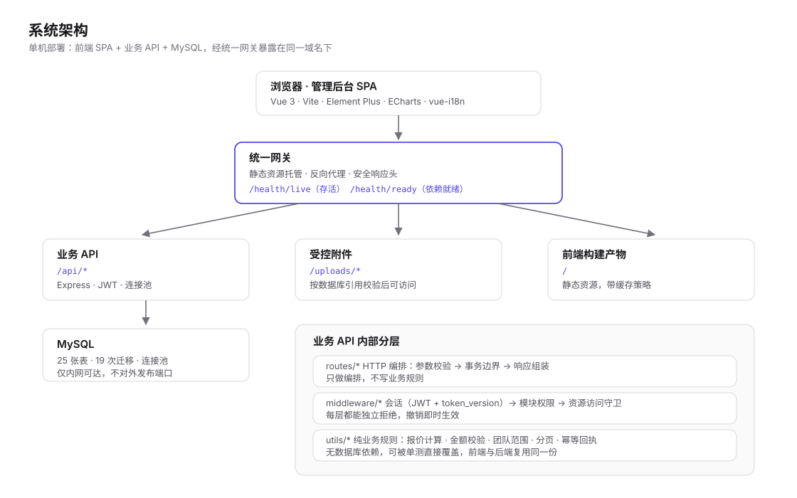

# 船舶外贸业务管理后台 · 架构说明与代码样本

> 这是一套**面向船舶设备外贸公司的业务管理后台**。完整系统为商业项目，源码不公开；
> 本仓库是从中抽取的**架构说明 + 关键模块代码样本**，用于展示工程设计与编码风格。
>
> 已剔除：对外官网代码、部署与服务器配置、内部工作记录。
> 仓库内不含任何真实客户、订单、金额、公司名称与服务器信息。

---

## 1. 系统做什么

一套内部使用的订单履约与账务管理系统，覆盖从询盘转入 → 报价 → 下单 → 工厂采购 →
履约节点 → 收付款 → 单证导出的完整链路。

| 模块 | 能力 |
| --- | --- |
| 客户与联系人 | 客户档案、联系人、跟进记录、重复客户检测、Excel 导出 |
| 工厂与产品 | 工厂档案、工厂产品库、产品图片（含上传类型与体积校验） |
| 报价 | 多版本报价、版本号并发控制、多币种、明细与附加金额校验、PDF 导出 |
| 订单 | 订单成本、履约节点、变更申请与审批、商业发票/装箱单导出 |
| 收付款 | 定金/尾款确认、付款记录（含作废）、工厂付款 |
| 组织与权限 | 用户/销售员、经理-销售两级团队、角色与菜单权限、资源访问守卫 |
| 运营支撑 | 统计看板、通知中心与自动化提醒、审计日志、数据质量检查 |

规模：**22 个业务页面 · 16 个后端模块 · 25 张数据表 · 19 次数据库迁移**。

---

## 2. 技术栈

| 层 | 选型 |
| --- | --- |
| 前端 | Vue 3 · Vite · Element Plus · ECharts · vue-i18n · vue-router · axios |
| 后端 | Node.js · Express · MySQL（mysql2 连接池）· JWT · bcryptjs |
| 文件 | multer（上传）· sharp（图片处理）· file-type（真实类型校验）· exceljs（导出） |
| 内建防护 | helmet · express-rate-limit · CORS 白名单 · 请求体体积上限 |
| 工程质量 | Node test runner · Vitest · Playwright · c8 覆盖率分区门禁 · ESLint · Prettier |

前端另用 jspdf + html2canvas 支持报价单与贸易单证的 PDF / 图片导出。

---

## 3. 架构



单进程 Express 应用承担业务 API，前端为独立 SPA，通过统一网关暴露在同一域名下：

```
浏览器 SPA ──► 网关（静态资源 + 反向代理 + 健康探针）
                    │
                    ├──► /api/*     业务 API（Express + MySQL）
                    └──► /uploads/* 受控的公开附件
```

API 内部分层（详见 `docs/ARCHITECTURE.md`）：

```
routes/*         HTTP 编排：参数校验、事务边界、响应组装
middleware/*     认证、模块权限、资源访问守卫
utils/*          纯业务规则（报价计算、金额校验、团队范围、分页、幂等回执）
```

设计原则：**路由层只做编排，业务规则下沉到 `utils/` 的纯函数**，因此核心规则可以用单元测试直接覆盖，
不依赖数据库。

---

## 4. 四个值得展开的设计

### 4.1 权限：从令牌到数据行的四层收敛

1. `authMiddleware` 校验 JWT，**并回库读取 `token_version`** —— 改密或强制下线即失效，不依赖令牌自带的旧声明；
2. `requirePasswordChanged` 拦截未完成首次改密的账号；
3. `requireModulePermission(...)` 按模块拒绝无权访问的路径；
4. `ownerScopeSql / ownerScopeParams` 把「经理只能看本人及直属团队」编译进 SQL 的 `WHERE`，
   列表、详情、导出、统计共用同一套范围函数。

团队名单**每次请求从数据库取**，不接受请求体或令牌里的团队声明（`samples/api/utils/owner-scope.js`）。

### 4.2 财务一致性：幂等键 + 行锁 + 版本号

- 所有涉及金额写入的接口**必须携带 `Idempotency-Key`**，缺失直接拒绝；
  前端为每个提交按「身份 + 路径 + 载荷」的哈希生成稳定键，成功后才轮换
  （`samples/web/api/submission-keys.js`）；
- 报价多版本用**版本号 + 行锁**防止并发覆盖，冲突时保留当前表单而不是静默覆盖；
- 金额一律按**整数分**计算，拒绝非法输入而不是静默归零或截断；
- 事务入口统一：获取连接纳入 try、回滚失败不掩盖原始错误、连接在 `finally` 释放。

### 4.3 菜单权限的单一来源

菜单键只在 `utils/menu-keys.js` 定义一次，后端权限校验、初始化和前端预设全部从它派生。
历史上出现过「初始化脚本与前端预设不一致 → 管理员保存一次权限就静默吊销某些账号菜单」的缺陷，
现在由契约测试钉死（`samples/api/utils/menu-keys.js`）。

### 4.4 错误码契约与三语

接口统一返回 `{ code, message }`，`message` **只允许稳定的大写错误码**，不允许英文散文；
前端按错误码查本地化文案。这样文案改动不会破坏接口契约，多语言也不会出现「后端返回的英文直接透传」。
配套两个门禁：硬编码中文扫描 + 英文散文全量普查。

---

## 5. 工程质量

| 项目 | 数值 |
| --- | --- |
| 自动化测试 | 721 项（API 580 · 前端 141），另有 132 项脚本自测 |
| 端到端 | Playwright 14 项（含真实浏览器下的业务流与跨团队越权校验） |
| 覆盖率门禁 | 纯逻辑层 95% · HTTP 编排层 92% · 前端 82% · 全盘 93%（lines） |
| 静态门禁 | 格式、编码、密钥扫描、三语、Lint、语法、生产构建、产物体积 |
| 备份 | 每日自动备份 + 隔离恢复演练（历史库 38 张表 / 上传附件） |

门禁不是「跑了就算」：新增门禁都会**故意制造一次失败**确认它真能拦住问题，再恢复。

覆盖率按分区分设阈值（`samples/quality/coverage-policy.mjs`），并有一条测试钉住
「纯逻辑层阈值必须高于 HTTP 编排层」——防止有人为了让门禁变绿而调低核心层的标准。

---

## 6. 仓库结构

```
.
├── docs/                    架构、数据模型、可靠性设计、多语言、样本索引
├── assets/                  架构图（SVG）
└── samples/                 代码样本（原样摘录，仅做脱敏）
    ├── api/                 装配层、中间件、业务规则工具
    ├── api-routes/          完整路由模块示例
    ├── web/                 路由守卫、请求层、幂等键、组件
    └── quality/             覆盖率策略、密钥扫描、中文/英文门禁
```

样本清单与「每个文件展示什么」见 **[docs/SAMPLES.md](docs/SAMPLES.md)**。

---

## 7. 说明

- **代码样本为原项目节选，不是可运行工程。** 文件按原样摘录（仅做脱敏），
  其 `import` 路径仍指向原 monorepo 结构，未包含的兄弟模块不在本仓库中。
- 其中的测试数据均为虚构；本仓库不含真实客户、订单、金额、合作方与服务器信息，
  也不含对外官网代码与部署配置。
- 作品展示用途，未授权商用或转载；如需完整源码，可在面试环节按需说明。

---

## English summary

A back-office system for a marine equipment trading company, covering the full
inquiry → quotation → order → fulfilment → payment → trade-document flow.
This repository is a curated extract (architecture notes + selected code samples)
from a private production codebase: **Vue 3 + Element Plus** on the front end,
**Express + MySQL** on the back end, with idempotency-key protected financial writes,
row-lock based quotation versioning, four-layer permission scoping and an
error-code contract for trilingual UI. See `docs/` for details.
